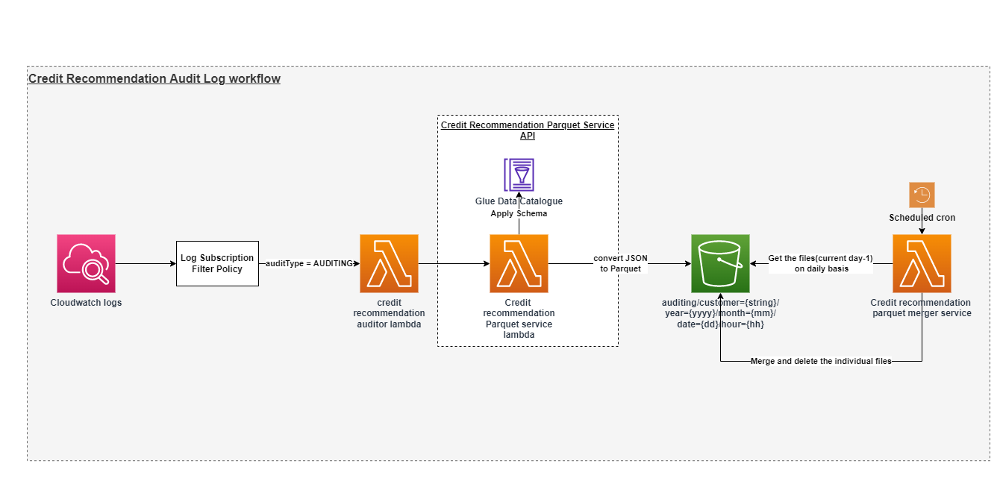

# Credit Recommendation Auditor

## Table of Contents

- [Introduction](#introduction)
- [Working](#working)
- [Deployment](#deployment)
- [References](#references)

## Introduction

- #### Credit Recommendation Auditor Workflow Diagram



- This repository is used to collect all the auditing logs generated by **credit-recommendation-service**.
- Logs gathered from the logs group of credit-recommendation-service are aggregated customer wise and is then sent to
  **credit-recommendation-parquet-service**.
- credit-recommendation-parquet-service saves the logs in a parquet format inside s3 bucket partitioned by customer, year, month, day and hour wise.
- These data are then used by athena service to query the auditing records.
- At the day end the merger service runs, and it fetches all the previous days parquet files and creates a single file containing the record for whole days. 

## Working

- This lambda is triggered automatically by AWS Cloudwatch Logs once the auditing log arrives in the log stream.
- There is a cloudwatch log event which can be found inside `function.yml` file. This event looks for the `AUDITING` filter pattern as shown below.

```
      cloudwatchLog:
          logGroup: /aws/lambda/credit-recommendation-service-${opt:stage}
          filter: 'AUDITING'
```

- The lambda function code of the auditor service can be found inside `handler.js` inside __src >> handlers >> aws__  folder

## Deployment

1. Execute below command by going to the folder where `package.json` resides and then install below node dependencies from
   terminal.

```
npm install -g serverless serverless-offline serverless-prune-plugin serverless-plugin-existing-s3 serverless-latest-layer-version serverless-python-requirements serverless-deployment-bucket
```

- execute below command to install project dependencies

```
npm install
```

2. Execute below command inside terminal by going inside the directory having `serverless.yml`
   file to deploy the service in aws cloud.

```
sls deploy --verbose --stage=<environment-name>
```

> #### Serverless.com framework is used as an infrastructure tool to create and deploy the resources on aws cloud

> #### Note in order to execute the above command you should have aws cli installed on your machine and aws client_id and client_secret configured along with the aws region that you want to deploy the resources in.

## References

- [Serverless framework documentation](https://www.serverless.com/framework/docs)
- [Serverless functions](https://www.serverless.com/framework/docs/providers/aws/guide/functions)
- [Serverless cloudwatch logs event](https://www.serverless.com/framework/docs/providers/aws/events/cloudwatch-log)
- [Serverless resources deployment](https://www.serverless.com/framework/docs/providers/aws/guide/deploying)
- [Serverless environment variables](https://www.serverless.com/framework/docs/providers/aws/guide/variables)