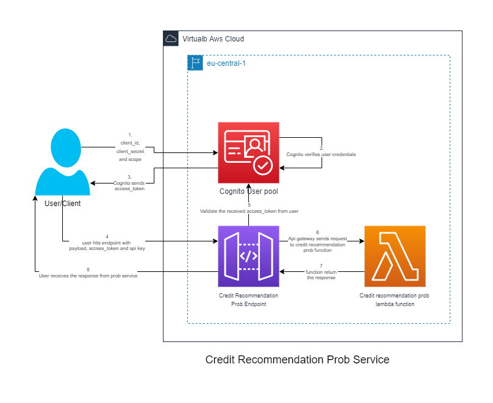

# Credit Recommendation Prob Service

## Table of Contents

- [Introduction](#introduction)
- [Process to generate access token](#generate-access-token)
- [Working](#working)
- [Decision](#decision)
- [Software to install](#software-to-install)
- [Local Testing](#local-testing)
- [Deployment](#deployment)
- [References](#references)

## Introduction

- #### Credit Recommendation Prob Service Workflow Diagram



## Generate-access-token

### Please follow below steps to generate access token

1. Create a new request in **Postman** and change the http method type to `POST`
2. Insert `https://dev-auth.virtualb.cloud/oauth2/token` in the url section
3. Go to **body** and select `x-www-form-urlencoded`
4. Insert below keys and values in the body
    - *key* : `grant_type`, *value* : `client_credentials`
    - *key* : `scope`, *value* : `prob/write`
5. Insert below key and value in header
    - *key* : `Authorization`, *value* : `Basic Base64Encode(client_id:client_secret)`
        - **Note**: <br />
          you have to get the client_id and client_secret, and then you have to perform base64encode on *<client_id>:<client_secret>*
6. And finally send the request

## Working

- In order to call the service, the user/client has to send the request at `https://<env>.api.virtualb.cloud/prob` endpoint with `POST` httpMethod.
- Since this service is protected by cognito authorizer, the user/client has to obtain the access_token as explained [here](#generate-access-token)
- The `access_token` obtained from above step needs to go as part of `Authorization` header as
  bearer token.
    - `Authorization` : `Bearer <access_token>`
- user/client also need to provide `x-api-key` as part of the header.
- As part of the body user needs to send the data in a below format

```
{
    "UserID": 1,
    "User": {
        "Behaviour": {
            "Default": false,
            "Device": 1,
            "Lifetime": 20220708,
            "OnboardingTime": 70,
            "RegistrationDatetime": "021212",
            "WeeklyVisitNumber": 1
        },
        "Finance": {
            "AvarageAccountSpending": 1,
            "AvarageCreditSpending": 1,
            "AvarageTransactionsAmount": 1.5,
            "RID": 1,
            "Balance": {
                "Avg": 1.5,
                "Max": 1.5,
                "Min": 1.5,
                "Withdrawls": 1
            },
            "Cumsum": {
                "In": 1.5,
                "Out": 1.5
            },
            "EoP": {
                "Deposit": 1.5,
                "Investments": 1.5,
                "Loans": 1.5,
                "Mortgages": 1.5
            },
            "TotalLoans": {
                "Amount": 1.5,
                "Number": 1,
                "Salary": false
            }
        },
        "GenericInfo": {
            "Address": 1,
            "Birth": 19900607,
            "Gender": 1,
            "Type": 1
        },
        "Job": {
            "Education": 3,
            "Employed": true,
            "Position": 6,
            "Sector": 18
        }
    }
}
```

- After hitting the endpoint, if the above data are valid, then this endpoint will return the below response.

```
{
    "estimate": {
        "UserID": 1,
        "default_probability": 0.0715,
        "sign": 1
    }
}
```

## Decision

- Since the size of code along with all the dependencies was exceeding the permissible limit of the lambda function,
  the decision is taken to deploy this code as a lambda container function.
- Docker is used as the container runtime.
- Images created are pushed into `AWS ECR( Elastic Container Registry)` in private registry

## Software to install

- [AWS CLI](https://docs.aws.amazon.com/cli/latest/userguide/getting-started-install.html)
- [Docker](https://docs.docker.com/engine/install/)
- [Nodejs](https://nodejs.org/en/download/)
- [Python](https://www.python.org/downloads/)

## Local Testing

> #### NOTE: All the software mentioned in `Software to install` section should be installed on local machine before executing below command

- In order to test the function locally execute below command
    - `docker build -t credit_recommendation_service`
        - this command builds the docker image as per dockerfile specification which can be seen [here](Dockerfile)
        - `credit_recommendation_service` is the name of the image
    - `docker run -d --rm --name cr_service -p 9001:8080 credit_recommendation_service`
        - This command runs the `credit_recommendation_service` image on machine port `9001` in detached mode.
- Once the container is up and active
    - Open Postman and hit the endpoint `http://localhost:9001/2015-03-31/functions/function/invocations` with HttpMethod as `POST`
    - With Body as shown below

```
{
    "body": {
        "UserID": 1,
        "User": {
            "Behaviour": {
                "Default": false,
                "Device": 1,
                "Lifetime": 20220708,
                "OnboardingTime": 70,
                "RegistrationDatetime": "021212",
                "WeeklyVisitNumber": 1
            },
            "Finance": {
                "AvarageAccountSpending": 1,
                "AvarageCreditSpending": 1,
                "AvarageTransactionsAmount": 1.5,
                "RID": 1,
                "Balance": {
                    "Avg": 1.5,
                    "Max": 1.5,
                    "Min": 1.5,
                    "Withdrawls": 1
                },
                "Cumsum": {
                    "In": 1.5,
                    "Out": 1.5
                },
                "EoP": {
                    "Deposit": 1.5,
                    "Investments": 1.5,
                    "Loans": 1.5,
                    "Mortgages": 1.5
                },
                "TotalLoans": {
                    "Amount": 1.5,
                    "Number": 1,
                    "Salary": false
                }
            },
            "GenericInfo": {
                "Address": 1,
                "Birth": 19900607,
                "Gender": 1,
                "Type": 1
            },
            "Job": {
                "Education": 3,
                "Employed": true,
                "Position": 6,
                "Sector": 18
            }
        }
    }
}    
              
```

## Deployment

1. Execute below command by going to the folder where `package.json` resides and then install below node dependencies from
   terminal.

```
npm install -g serverless serverless-offline serverless-prune-plugin serverless-plugin-existing-s3 serverless-latest-layer-version serverless-python-requirements serverless-deployment-bucket
```

- execute below command to install project dependencies

```
npm install
```

> #### *Since this function is deployed as a lambda container, docker must be installed on the local machine before executing below command*

2. Execute below command inside terminal by going inside the directory having `serverless.yml`
   file to deploy the service in aws cloud.

```
sls deploy --verbose --stage=<environment-name>
```

> #### *Serverless.com framework is used as an infrastructure tool to create and deploy the resources on aws cloud*

> #### *Note in order to execute the above command you should have aws cli installed on your machine and aws client_id and client_secret configured
along with the aws region that you want to deploy the resources in.*

## References

- [Serverless framework documentation](https://www.serverless.com/framework/docs)
- [Serverless functions](https://www.serverless.com/framework/docs/providers/aws/guide/functions)
- [Serverless resources deployment](https://www.serverless.com/framework/docs/providers/aws/guide/deploying)
- [Cognito Oauth2 client credential flow](https://docs.aws.amazon.com/cognito/latest/developerguide/token-endpoint.html)
- [AWS Supported Ouath2 flows](https://aws.amazon.com/blogs/mobile/understanding-amazon-cognito-user-pool-oauth-2-0-grants/)
- [Generate access token](https://docs.aws.amazon.com/cognito/latest/developerguide/token-endpoint.html)
